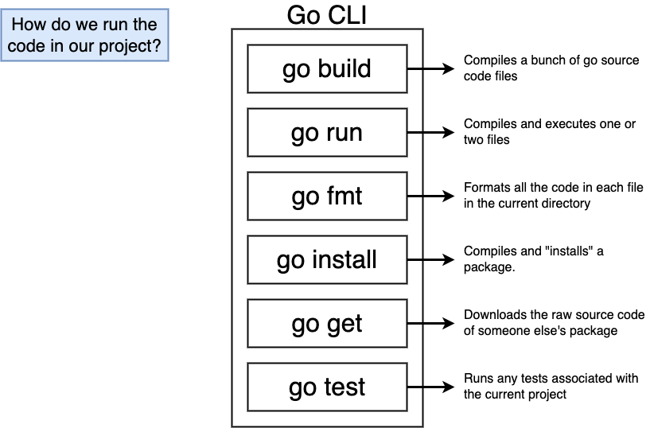

# Golang

* https://gobyexample.com/
* https://astaxie.gitbooks.io/build-web-application-with-golang/content/en/index.html
* https://www.openmymind.net/The-Little-Go-Book/
* https://github.com/joncalhoun/GoBooks
* https://github.com/uber-go/guide/blob/master/style.md
* https://www.miek.nl/go/



There is also `go doc` for creating documentation and `go list` to list all the installed packages

### Go's 21st Century Characteristics
* Concurrency
* Distributed Systems
* Garbage Collection
* Memory Locality
* Readability

Three things that make Go fast, fun, and productive: **interfaces**, **reflection**, and **concurrency**.

#### Concurrency
* **Concurrent**:
Go makes it easy to “fire off” functions to be run as very lightweight threads. These threads are called **goroutines** in Go.
* **Channels**: Communication with these goroutines is done, either via shared state or via channels.
* Select enables task synchronization

#### Objects in Go
* Go uses **structs** with associated methods.
* Simplified implementation of classes
  * No inheritance
  * No constructors
  * No generics

### Workspaces

Three subdirectories
* `src` - contains source code files
* `pkg` - contains packages(libraries)
* `bin` - contains executables

```
    ├──src/
    |  ├──main.go
    |  ├──say/
    |  |  ├──say.go
    |  |  ├──say_test.go
    ├──bin/
    |  ├──say
    └──pkg/
       └──linux_amd64/
          └──say.a
```

Also refer https://github.com/golang-standards/project-layout

### Basics

In Go, a name is **exported** if it begins with a capital letter. For example, `Pizza` is an exported name, as is `Pi`, which is exported from the math package.

#### Arrays

* The type `[n]T` is an array of `n` values of type `T`.
* `var x [5]int = [5]int{1, 2, 3, 4, 5}` Array pre-defined with values
  * Length of literal must be length of array
  * `...` for size can also be used `x := [...]int{1, 2, 3, 4, 5}`

Iterating

```go
x := [3]int{1, 2, 3}

for i, v := range x {
    fmt.Printf("index %d, val %d", i, v)
}
```

#### Slice

* A "window" on an **underlying array**
* Variable size, up to the whole array
* Slice has 3 properties
  * **Pointer** indicates the start of the slice
  * **Length** `len()` is the number of elements in the slice
  * **Capacity** `cap()` is maximum number of elements - From start of slice to end of array 

```go
  arr := [...]int{1, 2, 3, 4, 5}

  sli := arr[1:3]
  fmt.Println(cap(sli), len(sli)) // 4 2
```

* Writing to slice changes underlying array
* Overlapping slices refer to the same array elements

Slice literals

* A slice literal is like an array literal without the length.
* This is an array literal: `[3]bool{true, true, false}`
* And this creates the same array as above, then builds a slice that references it:

```go
[]bool{true, true, false}
```

#### Variable Slices

* Create a slice(and array) using `make()`
* `sli = make([]int, 10)` 2 arguments: type and length/capacity
* `b := make([]int, 0, 5) // len(b)=0, cap(b)=5`

#### Byte Slices and Strings

```go
byte // alias for uint8

rune // alias for int32
     // represents a Unicode code point
```

In Go, a string is in effect a **read-only** slice of bytes. Ref: https://go.dev/blog/strings

```go
bs := []byte{71, 111}
fmt.Printf("%s", bs) // Output: Go
```

`%s` converts the byte slice to a string

```go
s := "Wow look at me"
bs := []byte(s)
fmt.Printf("%s", bs) // Output: Wow look at me
fmt.Printf("%d", bs) // Output: [87 111 119 32 108 111 111 107 32 97 116 32 109 101]
```

If we use unicode characters in a string

```go
bs := []byte("◺")
fmt.Println(bs) // Output: [226 151 186]
s := string(bs)
fmt.Println(len(s)) // Output: 3

fmt.Println(utf8.RuneCountInString(s)) // Output: 1

fmt.Printf("%+q\n", s) // "\u25fa"
fmt.Printf("%x\n", s) // e297ba
fmt.Printf("% x\n", s) // e2 97 ba

// Lower left triangle unicode (U+25FA)
// UTF-8 (hex)	0xE2 0x97 0xBA (e297ba)
// UTF-8 (binary)	11100010:10010111:10111010
// UTF-16 (hex)	0x25FA (25fa)
```

Also check: https://stackoverflow.com/questions/44565859/how-does-utf-8-encoding-identify-single-byte-and-double-byte-characters

#### Struct

Struct fields can be accessed through a struct pointer.

To access the field X of a struct when we have the struct pointer p we could write `(*p).X`. However, that notation is cumbersome, so the language permits us instead to write just `p.X`, without the explicit dereference.

```go
type Vertex struct {
    X int
    Y int
}

func main() {
    v := Vertex{1, 2}
    p := &v
    p.X = 1e9
    fmt.Println(v)
}
```

We can list just a subset of fields by using the `Name:` syntax. (And the order of named fields is irrelevant.)

```go
var (
    v1 = Vertex{1, 2}  // has type Vertex
    v2 = Vertex{X: 1}  // Y:0 is implicit
    v3 = Vertex{}      // X:0 and Y:0
    p  = &Vertex{1, 2} // has type *Vertex
)
```

#### methods

Go does not have classes. However, you can define methods on types.

A method is a function with a special **receiver argument**.

The receiver appears in its own argument list between the func keyword and the method name.

```go
type Person struct {
    name string
    age int
    city,phone string
}

// A person method
func (p Person ) SayHello() {
    fmt.Printf("Hi, I am %s, from %s\n", p.name, p.city)
}

// A person method
func (p Person) GetDetails() {
    fmt.Printf("[Name: %s, Age: %d, City: %s, Phone: %s]\n", p.name,p.age, p.city, p.phone)
}

func main() {
    p := Person{name:"Nishanth", age:24, city:"Warangal"}
    p.SayHello() // Hi, I am Nishanth, from Warangal
}
```

If you want to modify the data of a receiver from the method, the **receiver must be a pointer**.

```go
func (p *Person ) SayHello() {
    //Implementations here 
}
```

You can declare a method on non-struct types, too.

In this example we see a numeric type MyFloat with an Abs method.

You can only declare a method with a receiver **whose type is defined in the same package as the method**. You cannot declare a method with a receiver whose type is defined in another package (which includes the built-in types such as int).

```go
type MyFloat float64

func (f MyFloat) Abs() float64 {
    if f < 0 {
        return float64(-f)
    }
    return float64(f)
}

func main() {
    f := MyFloat(-math.Sqrt2)
    fmt.Println(f.Abs())
}
```
